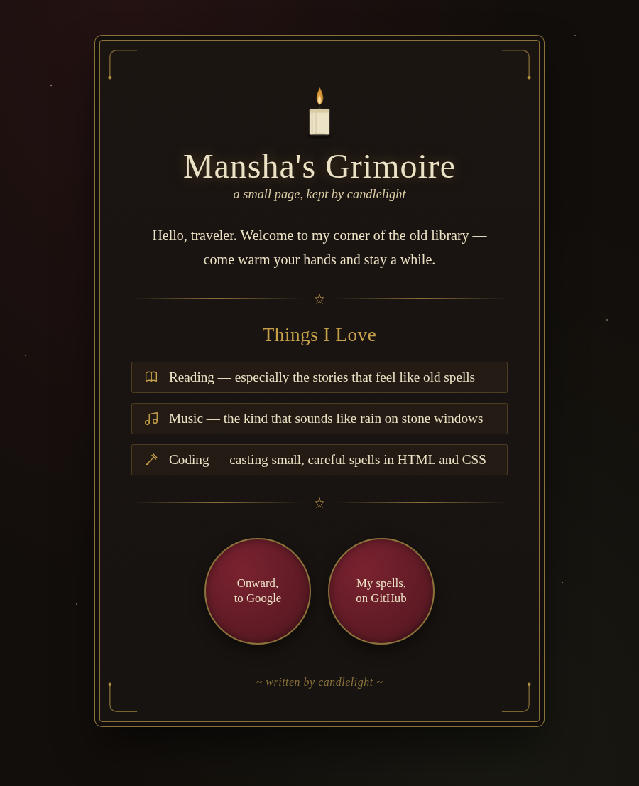
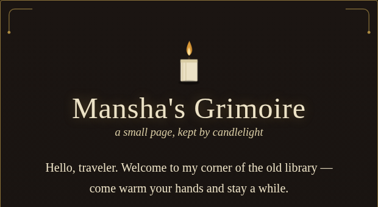
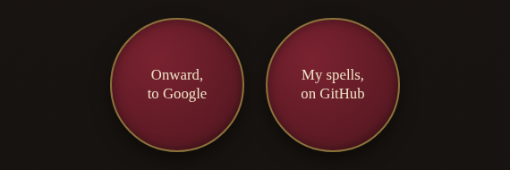
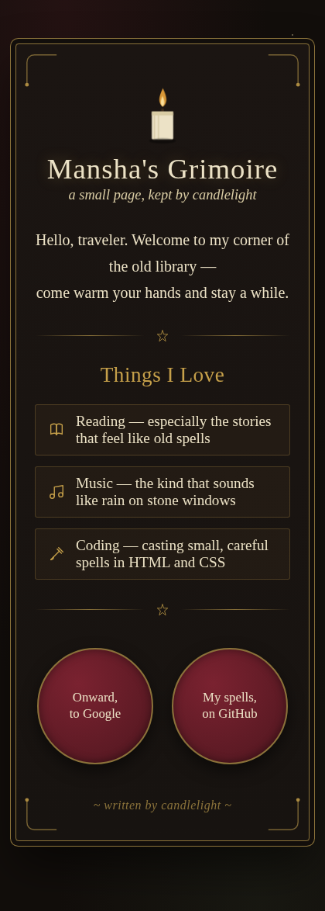

# Mansha's Grimoire 🕯️

A single-page personal site with a dark academia × Harry Potter vibe — candlelight, old parchment, wax seals, and a little bit of wizarding-world magic. Built with plain HTML and CSS, no frameworks.



<p float="left">
  
  
</p>

## Features

- Gothic display type (Pirata One) paired with a classic serif (Cormorant Garamond)
- Hand-drawn SVG candle with a flickering flame animation
- Ornamental corner flourishes and a starry night background
- A "hobbies" list styled like spellbook entries
- Wax-seal buttons linking out to Google and GitHub
- Fully responsive down to mobile

  

## Live demo
   ```
   https://waterlily07.github.io/grimoire-page/
   ```

